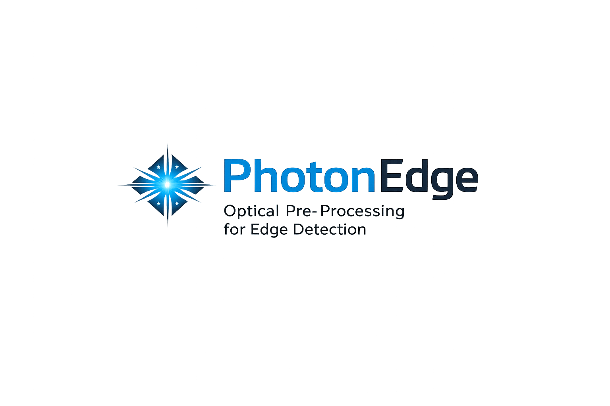

<p align="center">
  
</p>

# System Architecture

> **PhotonEdge** implements a hybrid optical-digital pipeline where the optical core performs band-pass convolution (DoG/LoG) in O(1) propagation time, and a minimal digital back-end extracts edge decisions with O(N) cost.

---

## Pipeline Overview

```
┌─────────────┐     ┌──────────────┐     ┌──────────────┐     ┌───────────┐
│  Input Image │────▶│  4f Optical   │────▶│  Detector +  │────▶│  Digital   │────▶ Edge Map
│  (scene)     │     │  DoG Filter   │     │  ADC Readout │     │  Post-Proc │
└─────────────┘     └──────────────┘     └──────────────┘     └───────────┘
     I(x,y)          Y = I ⊛ DoG          Digitized Y         ZC + Gate + Thin
                      ~0 pJ/px            0.5–6 pJ/px          20 pJ/px
                      0.3 ns              2.6–31 ms             < 1 ms
```

---

## Stage 1: Optical Core (L1 → L2)

### 4f Fourier-Plane Architecture

The system uses a classical 4f correlator/filter setup:

1. **Lens L1** performs a spatial Fourier transform of the input field E_in
2. **Fourier Plane** contains the DoG kernel H(u,v) as a transparency/DOE/SLM
3. **Lens L2** performs the inverse Fourier transform, producing the filtered output

```
         L1              Fourier Plane           L2
  ┌───┐  │  ┌───────────┐    │    ┌───────────┐  │  ┌───┐
  │   │──│──│           │────│────│           │──│──│   │
  │ E │  │  │  FT{E_in} │  H(u,v) │ IFT{·H}  │  │  │ Y │
  │_in│  │  │           │    │    │           │  │  │   │
  └───┘  │  └───────────┘    │    └───────────┘  │  └───┘
         f        f               f         f
```

### Mathematical Model

The optical output is:

```
E_out(x,y) = IFT{ FT{E_in(x,y)} · H(u,v) }
```

where the input field includes phase drift from imperfections:

```
E_in(x,y) = I(x,y) · exp(j · φ(x,y))
φ(x,y) ~ N(0, σ_drift²)
```

The detector captures intensity-like output (real component):

```
Y(x,y) = Re{E_out(x,y)} + noise(SNR)
```

### DoG Kernel

The Difference-of-Gaussians kernel implements band-pass filtering:

```
DoG(x,y) = G(σ₁) - G(σ₂)    where σ₁ < σ₂
```

This passes features with spatial frequency in the band between 1/σ₂ and 1/σ₁. Features smaller than ~2×σ₂ pixels are attenuated (band-limit).

### Canonical Parameters

| Parameter | Scale B (backbone) | Scale A (fine) | Scale C (coarse) |
|-----------|-------------------|----------------|------------------|
| σ₁ | 1.0 | 0.6 | 1.6 |
| σ₂ | 2.0 | 1.2 | 3.2 |
| Kernel size | 21×21 | 21×21 | 21×21 |
| Min feature | ~4 px | ~2.4 px | ~6.4 px |

### Kernel Embedding Options

| Option | Description | Energy | Reconfigurable | Latency |
|--------|-------------|--------|----------------|---------|
| **DOE** | Diffractive optical element (etched glass) | 0 J/frame | No | 0 |
| **SLM pre-config** | Liquid crystal, loaded once | ~0 J/frame | Yes (offline) | 0 |
| **SLM dynamic** | LC switched per frame/pass | 500 µJ/switch | Yes (per-frame) | 1 ms/switch |

---

## Stage 2: Readout (L2 → L3)

The detector array + ADC converts the analog optical output to digital values. This stage is the **dominant energy consumer** in the system.

### Readout Modes

| Mode | Bits/pixel | Fraction | Use Case |
|------|-----------|----------|----------|
| Full-frame 12-bit | 12 | 100% | Development, calibration |
| Full-frame 8-bit | 8 | 100% | Standard deployment |
| Edge-map 1-bit | 1 | 100% | Fixed threshold, minimum energy |
| ROI 8-bit | 8 | 5% | Event-driven, selective regions |

---

## Stage 3: Digital Post-Processing (L3 → Output)

All digital operations are O(N) in pixel count — no convolutions, no iterative optimization.

### 3a. Robust Normalization

```python
Z(x,y) = (Y(x,y) - median(Y)) / (1.4826 · MAD(Y))
```

Using median/MAD instead of mean/std provides resistance to outliers from phase drift artifacts.

### 3b. Gaussian Smoothing

```python
Z_smooth = gaussian_filter(Z, σ_smooth=0.9)
```

Light smoothing to reduce sub-pixel zero-crossing jitter. Single-pass, O(N).

### 3c. Zero-Crossing Detection (4-Neighborhood)

```python
# Right neighbor sign flip
flip_right = sign(Z[x,y]) × sign(Z[x,y+1]) < 0

# Down neighbor sign flip
flip_down = sign(Z[x,y]) × sign(Z[x+1,y]) < 0
```

Using only 4-connectivity (right + down) instead of 8-connectivity reduces false diagonal crossings.

### 3d. Maximum Amplitude Gate

```python
edge = zero_crossing AND (|Z| ≥ threshold)
```

The gate accepts a zero-crossing only if the amplitude on at least one side exceeds the threshold. This is the critical noise/drift rejection mechanism.

- **Fixed threshold**: t = 2.2σ (for single-regime deployment)
- **Adaptive threshold**: t = f(SNR_est) for multi-regime deployment

### 3e. Morphological Closing + Thinning

```python
edges = binary_closing(edges, 3×3)    # connect 1px gaps
edges = thin(edges)                    # optional skeleton
```

---

## Multi-Scale Extension

For sub-band feature recovery, PhotonEdge supports 2–3 optical passes with controlled fusion:

### Fusion v2: Fine-Only-Where-Needed

```
1. Run Scale B (+ optional C)  →  edges_BC
2. Dilate edges_BC by r pixels →  coverage_mask
3. Run Scale A (fine)          →  edges_A
4. Filter: edges_A_accepted = edges_A AND NOT coverage_mask
5. Fused = edges_BC OR edges_A_accepted
6. Close + Thin
```

This prevents Scale A from injecting false positives on smooth boundaries already covered by Scale B, while allowing it to recover thin features invisible to B.

---

## Evaluation Metric

PhotonEdge uses **symmetric distance-transform matching** (tol = 2 px):

```
TP = |{p ∈ Pred : dist(p, GT) ≤ tol}|
FP = |{p ∈ Pred : dist(p, GT) > tol}|
FN = |{g ∈ GT  : dist(g, Pred) > tol}|

Precision = TP / (TP + FP)
Recall    = TP / (TP + FN)
F1        = 2 · P · R / (P + R)
```

This metric is **physically appropriate** for analog optical systems where sub-pixel jitter and edge thickness are inherent properties, not defects. A tolerance of 2 pixels matches the natural width of DoG zero-crossings.

---

<p align="center">
  <sub>© 2024–2026 Vasile Lucian Borbeleac / FRAGMERGENT TECHNOLOGY S.R.L., Cluj-Napoca, Romania</sub>
</p>
