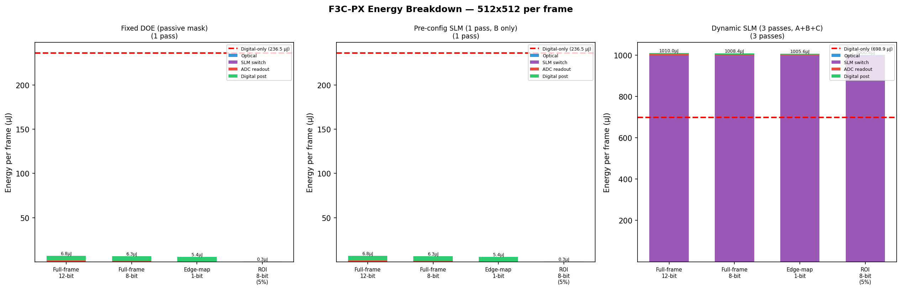
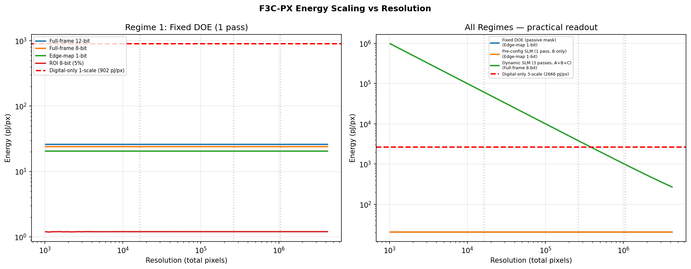
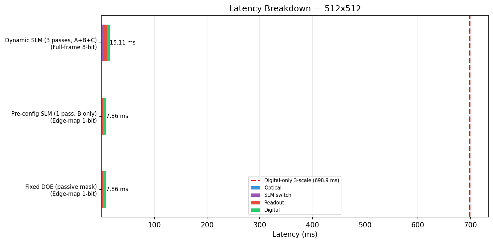

  

# Energy Model

> Parametric energy budget for PhotonEdge across three deployment regimes, with latency analysis and comparison against digital-only baseline.

---

## Core Insight

**The optical convolution is effectively free.** Laser propagation through the 4f system consumes ~1 pJ per frame (0.000004 pJ/pixel at 512×512). This is 0.0001% of the digital-only baseline.

**Energy is dominated by readout (ADC)**, which is architecturally controllable. Reducing from 12-bit full-frame to 1-bit edge-map cuts ADC energy by 12×. ROI-selective readout (5% of pixels) cuts total energy by 20×.

**SLM switching is the hidden cost.** Dynamic multi-scale (3 passes with per-frame SLM reconfiguration) consumes 500 µJ per switch — making the system 1.4× *more expensive* than digital-only. The energy advantage exists only in fixed-kernel deployment.

---

## Component Specifications

| Component | Parameter | Value | Source |
|-----------|-----------|-------|--------|
| **Laser** | CW power | 1 mW | Integrated VCSEL class |
| | Wall-plug efficiency | 30% | Conservative |
| | Propagation time | 0.3 ns | 10 cm optical path |
| **SLM** | Holding power | 200 mW | LCoS typical |
| | Switch energy | 500 µJ | Full LC reconfiguration |
| | Switch time | 1 ms | LC response time |
| **DOE** | Energy | 0 J | Passive diffractive element |
| **ADC** | Energy | 0.5 pJ/conv-bit | CMOS 65nm class |
| | Readout speed | 10 ns/pixel | Row-parallel rolling shutter |
| **Digital** | Operations | 20 ops/pixel | ZC + gate + fusion + thin |
| | Energy | 1 pJ/op | 28nm CMOS |
| **Baseline** | Conv MACs | 882/pixel/scale | 21×21 kernel, 2 ops/MAC |
| | MAC energy | 1 pJ/MAC | 28nm CMOS |

---

## Three Deployment Regimes

### Regime 1 — Fixed DOE (Passive Mask)

- Kernel etched into glass/substrate — zero reconfiguration energy
- Single optical pass — one scale (typically B)
- Ideal for high-volume, fixed-application deployment (industrial inspection, always-on cameras)

### Regime 2 — Pre-Configured SLM

- Kernel loaded once (not per-frame) — switching energy amortized to ~0
- Can reconfigure for different tasks between production runs
- Holding power (~200 mW) added to wall-plug budget

### Regime 3 — Dynamic Multi-Scale SLM

- SLM switches between kernel configurations per frame (2–3 passes)
- 500 µJ per switch + 1 ms latency per switch
- Required for multi-scale coverage (A + B + C)
- Energy advantage **negated** by SLM switching cost

---

## Energy Comparison — 512×512 Reference

  

### Per-Frame Energy

| Regime + Readout | Laser | SLM | ADC | Digital | **Total** | **pJ/px** | vs Digital |
|-----------------|-------|-----|-----|---------|-----------|-----------|------------|
| DOE + 12-bit | 1 pJ | 0 | 1.57 µJ | 5.24 µJ | **6.82 µJ** | **26.0** | 0.029× |
| DOE + 8-bit | 1 pJ | 0 | 1.05 µJ | 5.24 µJ | **6.29 µJ** | **24.0** | 0.027× |
| DOE + 1-bit | 1 pJ | 0 | 0.13 µJ | 5.24 µJ | **5.38 µJ** | **20.5** | 0.023× |
| DOE + ROI 5% | 1 pJ | 0 | 0.05 µJ | 0.26 µJ | **0.31 µJ** | **1.2** | 0.001× |
| SLM dynamic + 8-bit | 3 pJ | 1000 µJ | 3.15 µJ | 5.24 µJ | **1008 µJ** | **3847** | 1.44× |
| *Digital-only (1-scale)* | — | — | — | *236 µJ* | *236 µJ* | *902* | *(ref)* |
| *Digital-only (3-scale)* | — | — | — | *699 µJ* | *699 µJ* | *2666* | *(ref)* |

### Energy Breakdown by Component

  

---

## Resolution Scaling

  

### Cross-Resolution Comparison (Practical Readout)

| Resolution | Regime | Readout | pJ/px | Total µJ | vs Digital | Max FPS |
|-----------|--------|---------|-------|----------|------------|---------|
| 128×128 | DOE | 1-bit | 20.5 | 0.34 | **0.023×** | 2035 |
| 128×128 | SLM dynamic | 8-bit | 61,067 | 1000.5 | 22.9× | 355 |
| 512×512 | DOE | 1-bit | 20.5 | 5.4 | **0.023×** | 127 |
| 512×512 | SLM dynamic | 8-bit | 3,847 | 1008.4 | 1.44× | 66 |
| 1024×1024 | DOE | 1-bit | 20.5 | 21.5 | **0.023×** | 32 |
| 1024×1024 | SLM dynamic | 8-bit | 986 | 1033.6 | **0.37×** | 18 |

**Key observation**: at 1024×1024, even dynamic SLM becomes energy-advantaged (0.37×) because the digital convolution cost scales as O(N × k²) while SLM switching is fixed-cost.

---

## Latency Analysis

  

| Component | DOE (1-pass) | SLM Dynamic (3-pass) |
|-----------|-------------|---------------------|
| Optical propagation | 0.3 ns | 0.9 ns |
| SLM switching | 0 | 2 ms |
| Readout (512²) | 2.6 ms | 7.9 ms |
| Digital post-proc | 5.2 ms | 5.2 ms |
| **Total** | **7.9 ms** | **15.1 ms** |
| **Max FPS** | **127 Hz** | **66 Hz** |

Readout is the latency bottleneck in all regimes. The optical operation itself (0.3 ns) is negligible.

---

## SLM Holding Power

SLM static holding power is continuous (not per-frame) and must be accounted in the wall-plug budget:

| Resolution | 30 FPS | 100 FPS | 1000 FPS |
|-----------|--------|---------|----------|
| 128×128 | 406,901 pJ/px | 122,070 pJ/px | 12,207 pJ/px |
| 512×512 | 25,431 pJ/px | 7,629 pJ/px | 763 pJ/px |
| 1024×1024 | 6,358 pJ/px | 1,907 pJ/px | 191 pJ/px |

At low FPS / low resolution, SLM holding power dominates the budget. This reinforces the DOE advantage for fixed-kernel deployment.

---

## Value Proposition (Technical Summary)

> *"In fixed-kernel deployment (DOE or pre-configured SLM), PhotonEdge delivers edge maps at 20 pJ/pixel — 44× below digital-only convolution (902 pJ/pixel) — with the optical operation contributing < 0.001% of total system energy. The dominant cost is ADC readout, reducible to 1 pJ/pixel via 1-bit edge-map or ROI-selective sensing. Multi-scale deployment (3-pass with SLM) trades this energy advantage for spectral bandwidth coverage, with a crossover to energy-positive at resolutions ≥ 1024×1024."*

---

  © 2024–2026 Vasile Lucian Borbeleac / FRAGMERGENT TECHNOLOGY S.R.L., Cluj-Napoca, Romania

