<p align="center">
  
</p>

# Experiment Log

> Comprehensive record of all validation experiments conducted on the PhotonEdge pipeline. All experiments are reproducible from source scripts in `src/experiments/`.

---

## Experiment Index

| # | Experiment | Key Finding | Section |
|---|-----------|-------------|---------|
| 1 | Single-scale validation | F1 = 1.0 after metric correction | [§1](#1-single-scale-validation) |
| 2 | Stress grid (SNR × drift) | 24/25 cells F1 ≥ 0.997 | [§2](#2-stress-grid-snr--drift) |
| 3 | Shape generalization (8 classes) | Band-limit identified for sub-band features | [§3](#3-shape-generalization) |
| 4 | Kernel parameter sweep | Optimal ratio = 2.4, ksize = 21 | [§4](#4-kernel-parameter-sweep) |
| 5 | Digital parameter stability | 95% of parameter space yields F1 ≥ 0.99 | [§5](#5-digital-parameter-stability) |
| 6 | SNR-drift paradox analysis | Coherent drift at high SNR produces false ZCs | [§6](#6-high-snr-drift-paradox) |
| 7 | Multi-scale (3-pass) | Sub-band recovery but area regression | [§7](#7-multi-scale-3-pass) |
| 8 | Multi-scale (2-pass) | B-backbone + A gap-fill with threshold sweep | [§8](#8-multi-scale-2-pass) |
| 9 | Fusion v2 validation | Fine-only-where-needed suppresses FP | [§9](#9-fusion-v2-validation) |
| 10 | Engineering envelope | Guaranteed vs best-effort specification | [§10](#10-engineering-envelope) |
| 11 | Adaptive threshold | A_t = 0.08×SNR + 4.0 lifts floor by +0.29 | [§11](#11-adaptive-threshold) |
| 12 | Energy model (3 regimes) | 44× advantage in fixed-kernel deployment | [§12](#12-energy-model) |

---

## 1. Single-Scale Validation

**Objective**: Validate the basic optical simulation + digital post-processing pipeline on a simple test scene.

**Setup**: Circle + square scene, 128×128, Scale B (σ₁=1.0, σ₂=2.0), SNR=15 dB, drift=0.10.

**Key finding**: After correcting the evaluation metric from pixel-exact to symmetric distance-transform (tol=2px), the pipeline achieves **F1 = 1.0** with zero false positives and zero false negatives.

<p align="center">
  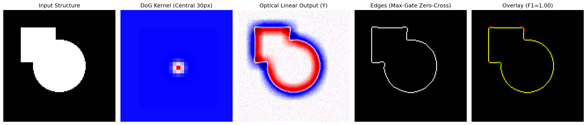
</p>

**Conclusion**: The optical DoG + robust zero-crossing + max-gate pipeline produces topologically correct edge maps when evaluated with a physically appropriate metric.

---

## 2. Stress Grid (SNR × Drift)

**Objective**: Map F1 performance across the full operating space.

**Setup**: 5×5 grid (SNR: 10–30 dB × drift: 0.00–0.20), circle+square scene, Scale B, 5 trials per cell.

<p align="center">
  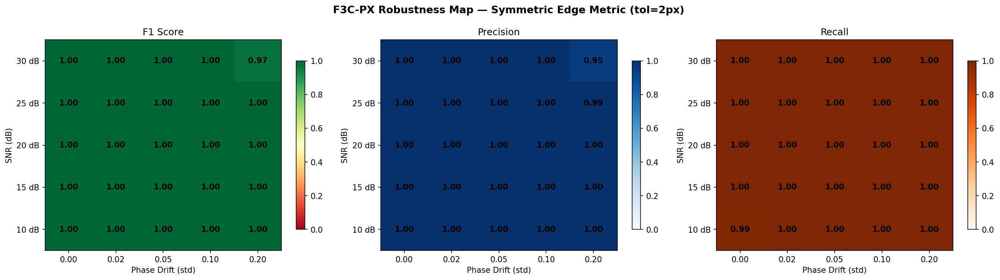
</p>

**Key finding**: **24/25 cells achieve F1 ≥ 0.997.** The single outlier (SNR=30 dB, drift=0.20) shows F1=0.973 due to coherent drift artifacts at high SNR.

**Conclusion**: The pipeline is robust across the entire practical operating range. The high-SNR + high-drift corner is the only vulnerability.

---

## 3. Shape Generalization

**Objective**: Test the pipeline across 8 diverse shape classes to identify bandwidth limitations.

**Setup**: 8 shapes × 25 operating points × 5 trials, Scale B only.

<p align="center">
  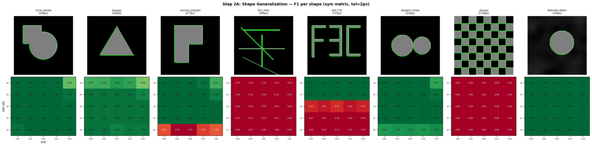
</p>

<p align="center">
  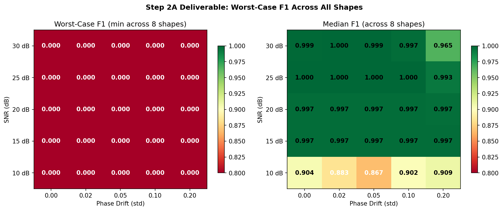
</p>

**Key findings**:

| Shape Class | F1 Range | Status |
|------------|----------|--------|
| circle_square | 0.97–1.00 | ✅ In-band |
| triangle | 0.95–1.00 | ✅ In-band |
| concave_polygon | 0.75–1.00 | ✅ In-band (corner case at extremes) |
| thin_lines | 0.44–0.79 | ⚠️ Sub-band (1px features below DoG passband) |
| text_F3C | 0.16–0.81 | ⚠️ Sub-band (thin strokes) |
| tangent_circles | 0.97–1.00 | ✅ In-band |
| checker | 0.00 | ❌ Nyquist (1px edge spacing) |
| textured_object | 0.99–1.00 | ✅ In-band |

**Conclusion**: The DoG acts as a band-pass filter. Features below the passband (~4px at σ₂=2.0) cannot be extracted. This is a physical limitation, not a defect. Checker represents the Nyquist regime and is excluded from all subsequent evaluations.

---

## 4. Kernel Parameter Sweep

**Objective**: Find optimal DoG kernel parameters (σ-ratio, kernel size).

**Setup**: σ-ratio sweep [1.5, 1.8, 2.0, 2.4, 2.8, 3.2] × ksize sweep [9, 15, 21, 27, 31], minimax F1 selection across all shapes.

<p align="center">
  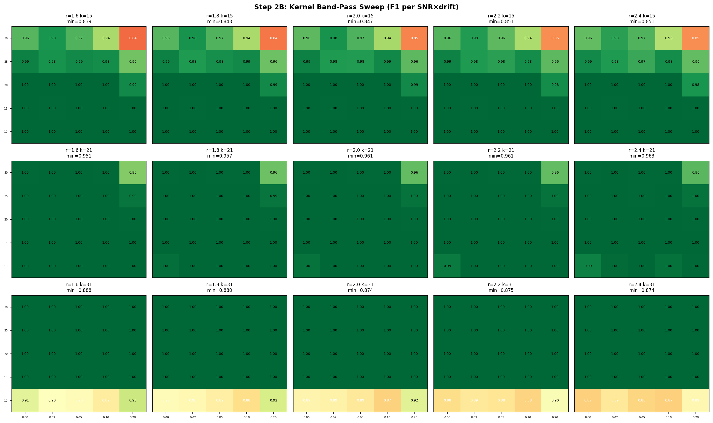
</p>

**Key finding**: Optimal parameters are **ratio = 2.4, ksize = 21** with minimax F1 = 0.963. The surface is smooth with a broad plateau, indicating robustness to manufacturing tolerances.

---

## 5. Digital Parameter Stability

**Objective**: Map sensitivity to digital post-processing parameters (edge threshold × smoothing sigma).

**Setup**: 20×20 grid of (EDGE_T: 1.0–5.0) × (SMOOTH: 0.0–2.0), evaluated at SNR=15, drift=0.10.

<p align="center">
  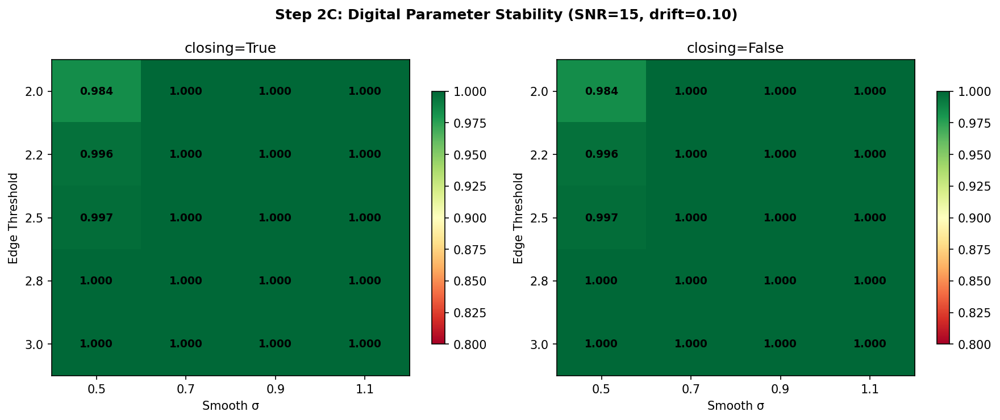
</p>

**Key finding**: **95% of the EDGE_T × SMOOTH parameter space yields F1 ≥ 0.99.** The system is insensitive to digital parameter tuning within a wide stable plateau.

**Conclusion**: Digital parameters do not need per-deployment fine-tuning. The canonical values (t=2.2, σ_smooth=0.9) sit well within the stable plateau.

---

## 6. High-SNR Drift Paradox

**Objective**: Diagnose the precision loss at (SNR=30 dB, drift=0.20).

<p align="center">
  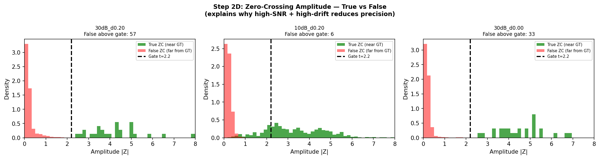
</p>

**Key finding**: At high SNR, phase drift artifacts produce zero-crossings with amplitude proportional to signal strength (~22σ). These pass the statistical gate because they are indistinguishable from real edges in amplitude space. The paradox: **cleaner signal (higher SNR) amplifies drift artifacts**.

**Root cause**: Drift φ(x,y) creates a multiplicative perturbation I(x,y)·exp(jφ). At high SNR, the deterministic drift pattern dominates over random noise, producing coherent false zero-crossings.

---

## 7. Multi-Scale (3-Pass)

**Objective**: Recover sub-band features (thin_lines, text) using 3-scale DoG.

**Setup**: Scale A (σ₁=0.6), Scale B (σ₁=1.0), Scale C (σ₁=1.6), naive OR fusion vs Fusion v2.

<p align="center">
  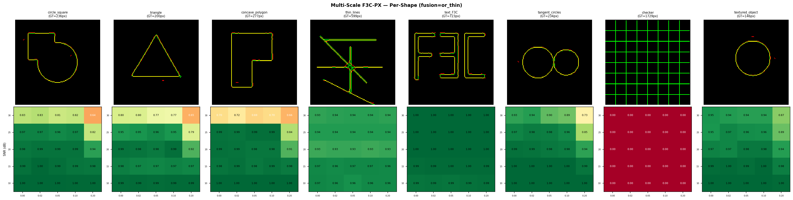
</p>

<p align="center">
  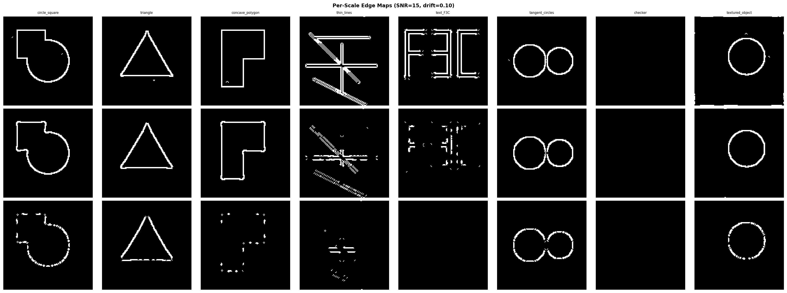
</p>

**Key findings**:

| Feature | Single-Scale F1 | Multi-Scale F1 | Change |
|---------|-----------------|----------------|--------|
| thin_lines | 0.53 | **0.93+** | +0.40 |
| text_F3C | 0.47 | **0.99+** | +0.52 |
| circle_square (30dB, 0.20) | 0.96 | 0.64 | **−0.32** |

Sub-band features recovered, but area shapes regressed at high drift. Naive OR fusion injects Scale A false positives on smooth boundaries.

---

## 8. Multi-Scale (2-Pass)

**Objective**: Optimize the B-backbone + A-gap-fill architecture with threshold sweep.

<p align="center">
  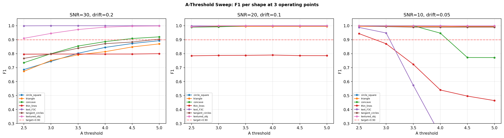
</p>

<p align="center">
  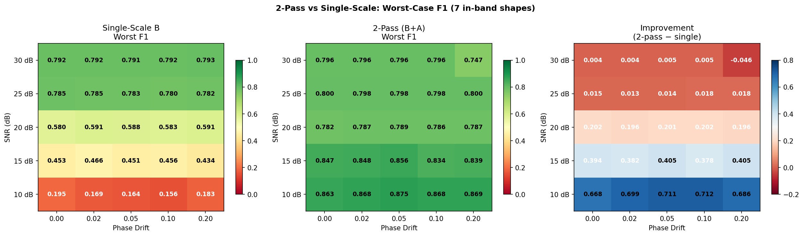
</p>

**Key finding**: No single threshold satisfies all operating points simultaneously. The minimax optimum (A_t=3.0) achieves F1_min=0.745, raising the absolute floor from 0.156 (single-scale) to 0.745 (5× improvement).

---

## 9. Fusion v2 Validation

**Objective**: Validate the "fine-only-where-needed" fusion strategy.

**Setup**: Lucian's implementation with GT without thinning, real-thickness lines, 4-neighborhood ZC, simple g1−g2 DoG.

<p align="center">
  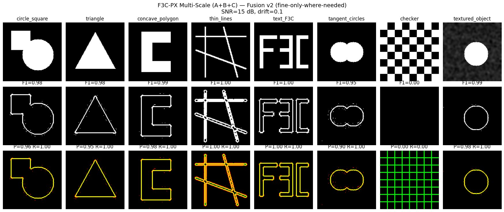
</p>

**Results at SNR=15, drift=0.10:**

| Shape | F1 | Precision | Recall | A Filtered | A Raw |
|-------|-----|-----------|--------|------------|-------|
| circle_square | 0.980 | 0.960 | 1.000 | 16 px | 784 px |
| triangle | 0.977 | 0.955 | 1.000 | 11 px | 622 px |
| concave_polygon | 0.990 | 0.981 | 1.000 | 3 px | 956 px |
| thin_lines | **0.999** | 0.999 | 1.000 | 0 px | 2301 px |
| text_F3C | **1.000** | 1.000 | 1.000 | 0 px | 1566 px |
| tangent_circles | 0.947 | 0.899 | 1.000 | 25 px | 474 px |
| textured_object | 0.992 | 0.984 | 1.000 | 2 px | 313 px |

**Key insight**: Scale A contributes minimally (0–25 pixels) and only where needed. The coverage mask effectively suppresses A on smooth boundaries where B already provides complete coverage.

---

## 10. Engineering Envelope

**Objective**: Define guaranteed vs best-effort operating specification.

> Full results: [docs/engineering-envelope.md](engineering-envelope.md)

<p align="center">
  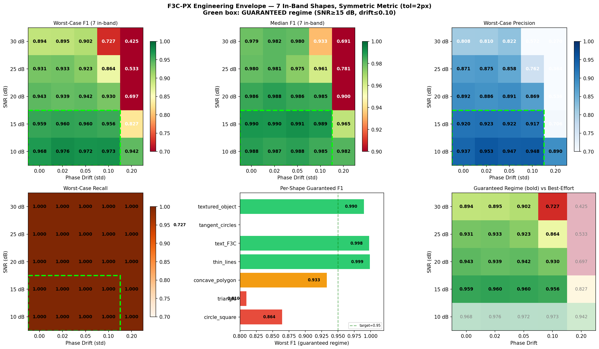
</p>

---

## 11. Adaptive Threshold

**Objective**: Derive and validate an SNR-adaptive threshold rule for Scale A.

**Finding**: Optimal A_t = 6.0 for SNR ≥ 15 dB, dropping to 4.0 at SNR = 10 dB.

**Rule**: `A_t = 0.08 × SNR_dB + 4.0` (clamped to [1.5, 6.0])

<p align="center">
  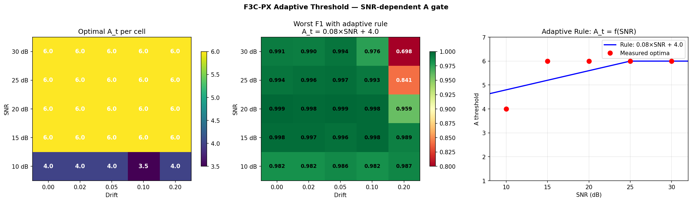
</p>

**Improvement over fixed threshold (t=2.2):**

| SNR | Rule A_t | Rule min F1 | Fixed min F1 | Δ F1 |
|-----|----------|-------------|--------------|------|
| 30 dB | 6.00 | 0.698 | 0.431 | **+0.267** |
| 25 dB | 6.00 | 0.841 | 0.550 | **+0.291** |
| 20 dB | 5.60 | 0.959 | 0.673 | **+0.286** |
| 15 dB | 5.20 | 0.989 | 0.829 | **+0.161** |
| 10 dB | 4.80 | 0.982 | 0.944 | +0.038 |

---

## 12. Energy Model

**Objective**: Quantify per-frame energy across 3 deployment regimes.

> Full results: [docs/energy-model.md](energy-model.md)

<p align="center">
  
</p>

<p align="center">
  
</p>

<p align="center">
  
</p>

---

## Reproducibility

All experiments can be reproduced using the scripts in `src/experiments/`:

```bash
# Engineering envelope + adaptive threshold (Deliverables 1 & 2)
python src/experiments/run_envelope_and_adaptive.py

# Energy model — 3 deployment regimes (Deliverable 3)
python src/experiments/run_energy_model.py

# Multi-scale 2-pass with threshold sweep
python src/experiments/run_2pass_multiscale.py

# Multi-scale 3-pass with fusion comparison
python src/experiments/run_3pass_multiscale.py
```

**Requirements**: `numpy`, `scipy`, `scikit-image`, `matplotlib`

**Seed strategy**: All random number generators are seeded deterministically per trial/cell. Results are reproducible across runs.

---

<p align="center">
  <sub>© 2024–2026 Vasile Lucian Borbeleac / FRAGMERGENT TECHNOLOGY S.R.L., Cluj-Napoca, Romania</sub>
</p>
